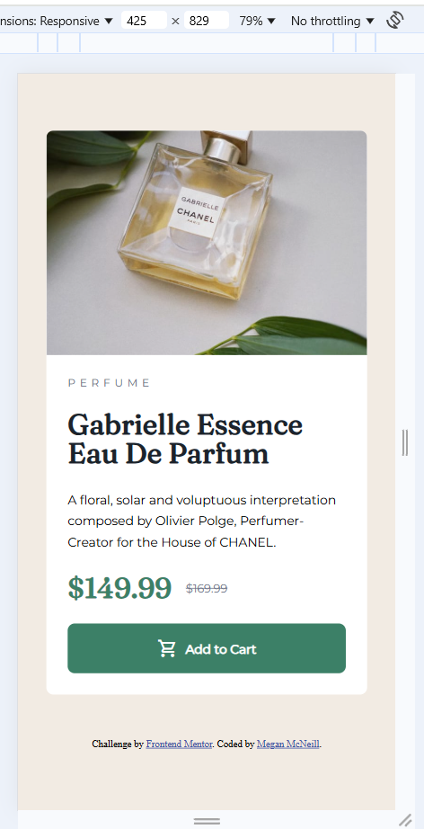
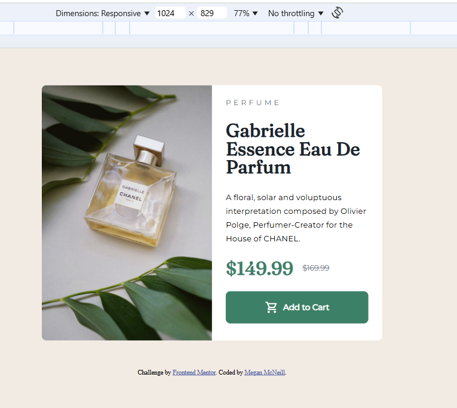

# Frontend Mentor - Product preview card component solution

This is a solution to the [Product preview card component challenge on Frontend Mentor](https://www.frontendmentor.io/challenges/product-preview-card-component-GO7UmttRfa). Frontend Mentor challenges help you improve your coding skills by building realistic projects. 

## Table of contents

- [Frontend Mentor - Product preview card component solution](#frontend-mentor---product-preview-card-component-solution)
  - [Table of contents](#table-of-contents)
  - [Overview](#overview)
    - [The challenge](#the-challenge)
    - [Screenshot](#screenshot)
    - [Links](#links)
  - [My process](#my-process)
    - [Built with](#built-with)
    - [What I learned](#what-i-learned)
  - [Author](#author)
  - [Acknowledgments](#acknowledgments)

## Overview

### The challenge

Users should be able to:

- View the optimal layout depending on their device's screen size
- See hover and focus states for interactive elements

### Screenshot

### Links

- Solution URL: [Github Repo](https://github.com/bluethreadmade/product-card-preview)
- Live Site URL: [Github Pages](hr)

## My process

### Built with

- Semantic HTML5 markup
- CSS custom properties
- Flexbox
- CSS Grid
- Mobile-first workflow

### What I learned

I learned that it is best to seperate the content from the styling in the html. For example wrapping a picture in a div to do the styling in the div rather than making the image itself a flex item.

## Author

- Website - [meganmcneill.dev](https://www.meganmcneill.dev)
- Frontend Mentor - [@bluethreadmade](https://www.frontendmentor.io/profile/bluethreadmade)

## Acknowledgments

Thanks to [@grace-snow](https://github.com/grace-snow) for their help! 
